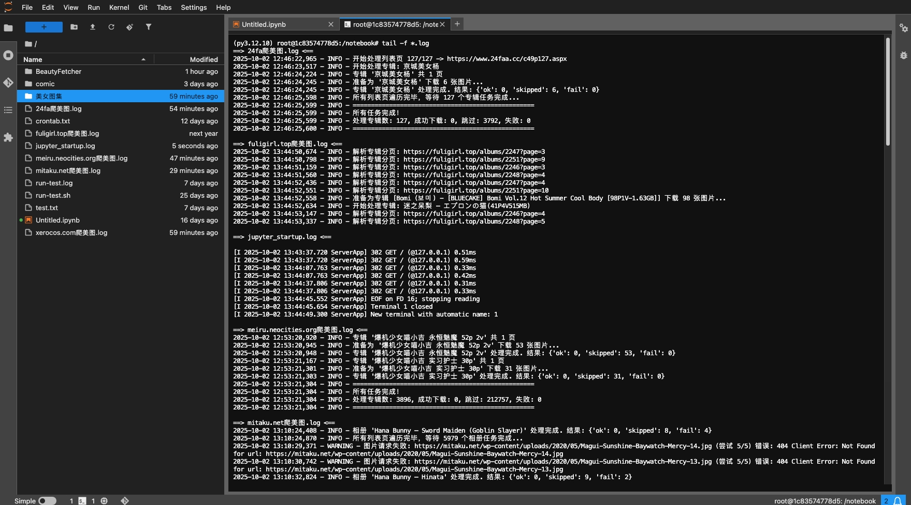

# BeautyFetcher
Python 脚本获取 24fa xerocos.com mitaku.net meiru.neocities.org 和 fuligirl.top 美女图片下载

    
<a href="https://star-history.com/#469138946ba5fa/BeautyFetcher&Date">
  <picture>
    <source media="(prefers-color-scheme: dark)" srcset="https://api.star-history.com/svg?repos=469138946ba5fa/BeautyFetcher&type=Date&theme=dark" />
    <source media="(prefers-color-scheme: light)" srcset="https://api.star-history.com/svg?repos=469138946ba5fa/BeautyFetcher&type=Date" />
    
  </picture>
</a>

# 目录结构：
    .
    ├── 24fa爬美图.py                                # 24fa 链接的Python脚本  
    ├── xerocos.com爬美图.py                         # xerocos.com 链接的Python脚本  
    ├── mitaku.net爬美图.py                          # mitaku.net 链接的Python脚本  
    ├── meiru.neocities.org爬美图.py                 # meiru.neocities.org 链接的Python脚本  
    ├── fuligirl.top爬美图.py                        # fuligirl.top 链接的Python脚本  
    └── README.md                                   # 这个是说明文件   

# 注意：
xerocos.com ~~meiru.neocities.org~~ 美图网挂了，哎可惜了

# 声明
本项目仅作学习交流使用，用于解决生理需求，学习各种姿势，不做任何违法行为。仅供交流学习使用，出现违法问题我负责不了，我也没能力负责，我没工作，也没收入，年纪也大了，你就算灭了我也没用，我也没能力负责。
